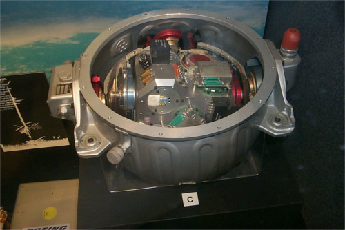

--- step ---
---
title: What is an IMU?
---

The Sense HAT has a movement sensor called an IMU, which can measure the kind of movement it is experiencing. IMU stands for Inertial Measurement Unit. It's actually three sensors in one:

- A gyroscope (measures momentum and rotation)
- An accelerometer (measures acceleration forces and can be used to find the direction of gravity)
- A magnetometer (measures the Earth's own magnetic field, so it's a bit like a compass)

Why is a movement sensor important, though? When you're up in space there is one question of absolute importance to which you must always know the answer: **which way am I pointing?**

If you don't know your orientation you are in big trouble, so an IMU sensor like this one is used on all manned and unmanned spacecraft to track movements and maintain an understanding of orientation. Even the earliest spacecraft had them. Ask your grandparents if they remember the [Apollo missions](http://en.wikipedia.org/wiki/Apollo_program) that landed humans on the surface of the moon.

Above is a picture of the IMU sensor from the Apollo command module. You'll notice how big it is compared to the tiny black cube on the Astro Pi; that's the difference between 1975 and 2015 technology. Incidentally, the Astro Pi IMU is probably not as accurate as the Apollo one, however it is a million times cheaper!

### How is orientation represented?

We all know the Earth rotates around an axis that runs between the North and South Poles. All objects in space or otherwise have *three* axes around which they can rotate. If you know how much rotation has happened on each axis, then you know which way the object is pointing.

The three axes are:

- **Pitch** (like a plane taking off)
- **Roll** (the plane doing a victory roll)
- **Yaw** (imagine steering the plane like a car)

Watch this short [video](https://www.youtube.com/watch?v=pQ24NtnaLl8) that shows where these axes are in relation to a plane. Try to imagine the plane pointing in any random direction. To get the plane into that position, you can rotate it by a known amount around each axis to get it to the orientation that you imagined.

The image above shows where these axes are in relation to the Sense HAT.

--- /step ---
